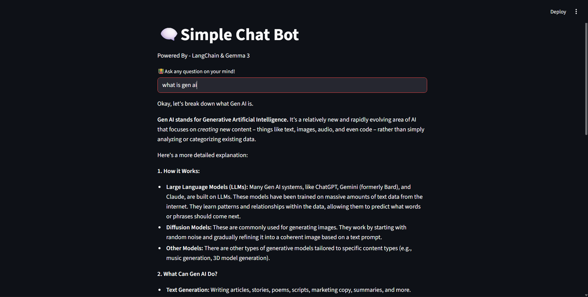

# 🗨️ Simple Chat Bot with Streamlit + LangChain + Gemma 3

This is a minimal **Streamlit chatbot** built using:
- [LangChain](https://www.langchain.com/) for prompt handling and chaining
- [Ollama](https://ollama.ai/) for running the **Gemma 3** model locally
- [Streamlit](https://streamlit.io/) for the UI
- [LangSmith](https://smith.langchain.com/) (optional) for experiment tracking

---

## 🚀 Features
- Simple chat interface powered by Streamlit
- Uses **Gemma 3 (4B)** LLM via Ollama
- LangChain prompt templating and parsing
- Optional **LangSmith tracing** for observability

---

## 📦 Installation

1. **Clone the repo**
   ```bash
   git clone https://github.com/your-username/simple-chatbot.git
   cd simple-chatbot
   ```

2. **Create & activate a virtual environment** (optional but recommended)

   ```bash
   python -m venv .venv
   source .venv/bin/activate   # Linux/Mac
   .venv\Scripts\activate      # Windows
   ```

3. **Install dependencies**

   ```bash
   pip install -r requirements.txt
   ```

4. **Install Ollama & Gemma 3**

   * [Download Ollama](https://ollama.ai/download)
   * Pull the model:

     ```bash
     ollama pull gemma3:4b
     ```

5. **Setup environment variables**
   Create a `.env` file in the project root:

   ```env
   LANGCHAIN_API_KEY=your_langsmith_api_key
   LANGCHAIN_PROJECT=your_project_name
   ```

   > If you don’t want to use LangSmith, you can skip these.

---

## ▶️ Usage

Run the Streamlit app:

```bash
streamlit run app.py
```
---

## 🖼️ Demo


*A simple chat with Gemma 3 via Streamlit.*

---

## 📚 Tech Stack

* **Python 3.10+**
* **Streamlit** - Web UI
* **LangChain** - Prompting & chaining
* **Ollama** - Local LLM inference
* **Gemma 3** - LLM model

---

## 📝 Notes

* Make sure `ollama serve` is running in the background.
* You can swap `gemma3:4b` with any Ollama-supported model.
* For production, consider adding session memory and better UI.

👉 Do you want me to also generate a **`requirements.txt`** for this project so you can just `pip install -r requirements.txt`?
```
